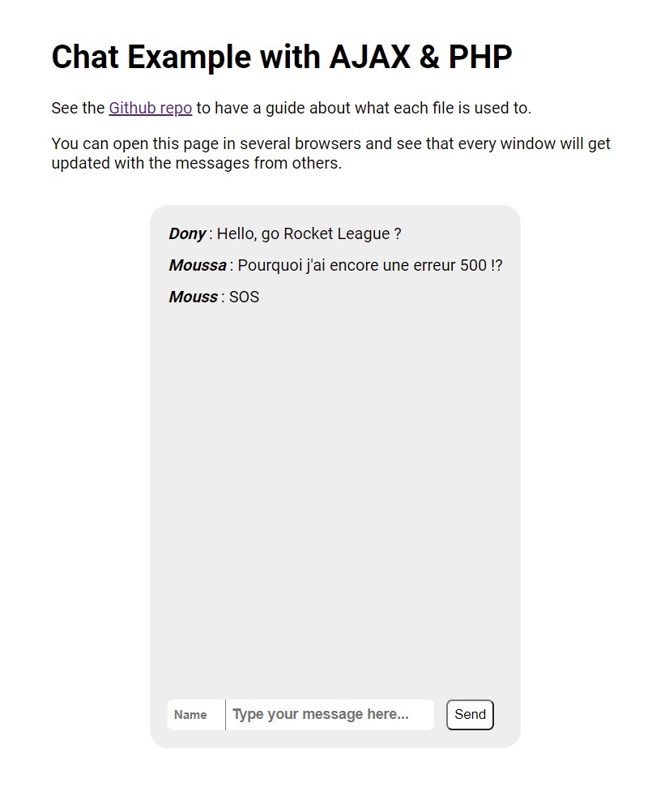

# Simple-PHP-Ajax-Chat

Very simple chat app to get an exemple in PHP / Ajax / JQuery :

_**Note :** You need a software in order to run the PHP (Wamp or Xamp are the most populars)_

## Files

**index.html** : Basic page with empty messages box. Linked to a script, a CSS file, and jQuery.

**getMessages.php** : PHP Script used for Get requests. It returns all the messages in a JSON format.

**postMessages.php** : PHP Script used for Post requests. It will save the message sent to this page, and then returns all the updated messages in JSON format.

**utils/Chat.php** : The PHP class where all the logic and interraction with JSON data is written. The `getMessages` and `postMessages` files are just calling methods of this class.

**scripts/chat.js** : Javascript that handles all the event. Every 2 seconds, it sends a Get request to `getMessages` in order to get updated. Everytime we want to send a message, it sends a POST Requests to `postMessages`. It can also transform the JSON data into HTML elements so that we can see the messages on the screen.

**data/messages.json** : A starting list of messages (just so that we do not have an empty screen to start with)

**style/main.css** : Just a few lines of CSS to make this chat more friendly

**doc/screenshot.jpg** : Just a screenshot to get a preview on Github.
